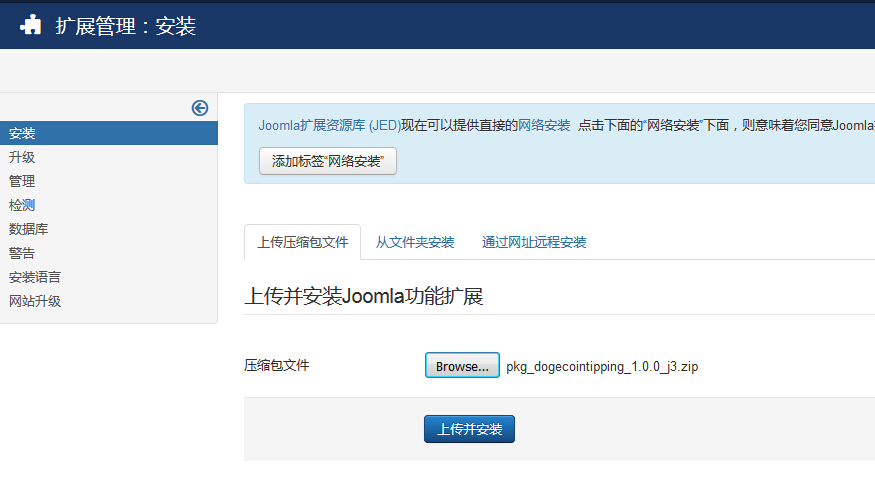

##安装
　　首先下载扩展安装包，然后在Joomla后台的“扩展管理器"中安装。

　　

##注意事项

　　服务器需要开启PHP的gmp, curl, mcrypt扩展。

　　如果是windows的服务器，SSL不能正常工作。需要下载[http://curl.haxx.se/ca/cacert.pem][1]到电脑中，然后在php.ini中增加一行来指定这个路径，比如。

	curl.cainfo=c:\path\to\cacert.pem

[1]: http://curl.haxx.se/ca/cacert.pem